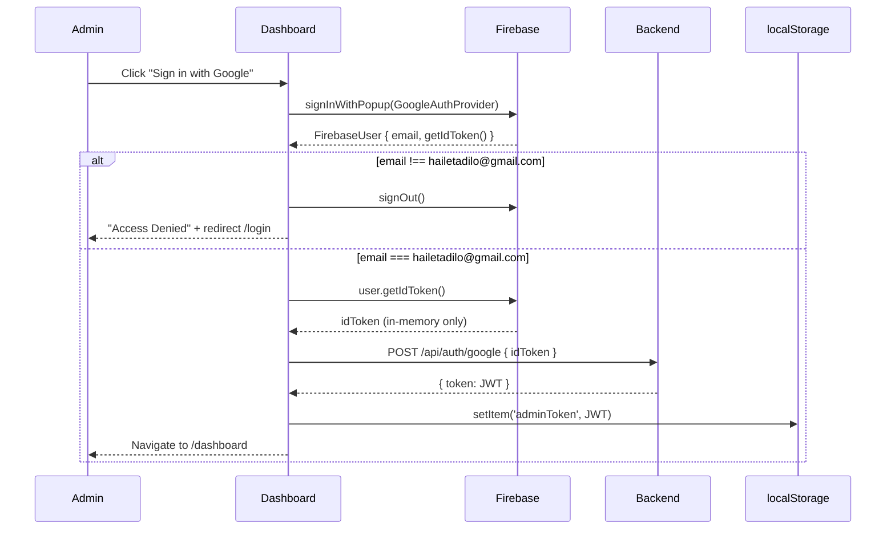

# Design Document

## Feature: Yeshi Clothe Admin Dashboard (`cloth_admin/`)

---

## Overview

The Admin Dashboard is a standalone React single-page application (SPA) deployed separately from the customer-facing site. It gives the sole administrator full control over orders, products, payments, customers, inventory, analytics, notifications, and site settings.

The app lives at `cloth_admin/` in the monorepo root. It communicates exclusively with the existing Node.js/Express backend over HTTPS using the same Firebase Authentication + JWT scheme already in use. No new backend framework or database is introduced — the React frontend is the only new artifact.

**Key design decisions:**

- **Vite + React** for fast builds and HMR during development. The environment variable prefix is `VITE_`.
- **React Router v6** for client-side routing, with a route guard component protecting every admin route.
- **React Query (TanStack Query)** for server state, caching, background re-fetching, and error boundaries.
- **Recharts** for all chart visualisations (bar, line). Chosen because it is React-native and tree-shakeable.
- **Tailwind CSS** for utility-first styling with dark/light mode via the `class` strategy and `data-theme` attribute.
- **Firebase JS SDK v9 (modular)** in the browser to initiate Google Sign-In and retrieve ID tokens. The JWT token exchange with the backend remains unchanged.
- **Vitest + React Testing Library** for unit and property-based tests; **fast-check** for property-based testing.

---

## Architecture

```mermaid
graph TD
    subgraph Browser [cloth_admin — Vercel]
        A[React Router] -->|Protected Route| B[Auth Context]
        B -->|JWT via x-auth-token| C[API Client (axios)]
        A --> D[Page Components]
        D --> E[React Query Hooks]
        E --> C
        F[Firebase SDK] -->|ID Token| C
        C -->|POST /api/auth/google| G
    end

    subgraph Backend [Render — existing]
        G[Express API] --> H[Firebase Admin]
        G --> I[Firestore]
        G --> J[Firebase Storage]
        G --> K[NotificationService]
        G --> L[smsService.js — new]
    end

    Browser -->|HTTPS / x-auth-token JWT| Backend
```

### Authentication Flow



---

## Components and Interfaces

### Directory Structure

```
cloth_admin/
├── public/
│   └── logo.png
├── src/
│   ├── main.jsx              # Vite entry point
│   ├── App.jsx               # Router + QueryClient + ThemeProvider
│   ├── api/
│   │   └── client.js         # Axios instance with auth interceptors
│   ├── auth/
│   │   ├── AuthContext.jsx   # Firebase + JWT state provider
│   │   ├── ProtectedRoute.jsx
│   │   └── LoginPage.jsx
│   ├── hooks/
│   │   ├── useOrders.js
│   │   ├── useProducts.js
│   │   ├── usePayments.js
│   │   ├── useCustomers.js
│   │   ├── useAnalytics.js
│   │   ├── useNotifications.js
│   │   └── useSettings.js
│   ├── pages/
│   │   ├── DashboardHome.jsx
│   │   ├── Orders.jsx
│   │   ├── Customers.jsx
│   │   ├── Products.jsx
│   │   ├── Categories.jsx
│   │   ├── Inventory.jsx
│   │   ├── Payments.jsx
│   │   ├── Analytics.jsx
│   │   ├── Notifications.jsx
│   │   ├── Settings.jsx
│   │   └── Profile.jsx
│   ├── components/
│   │   ├── layout/
│   │   │   ├── Sidebar.jsx
│   │   │   ├── Header.jsx
│   │   │   └── MobileNav.jsx
│   │   ├── orders/
│   │   │   ├── OrderTable.jsx
│   │   │   ├── OrderDetailPanel.jsx
│   │   │   ├── StatusTransitionButtons.jsx
│   │   │   └── InvoicePrintView.jsx
│   │   ├── products/
│   │   │   ├── ProductGrid.jsx
│   │   │   └── ProductForm.jsx
│   │   ├── charts/
│   │   │   ├── RevenueBarChart.jsx
│   │   │   └── DailyOrdersLineChart.jsx
│   │   ├── notifications/
│   │   │   └── NotificationBell.jsx
│   │   └── ui/
│   │       ├── KpiCard.jsx
│   │       ├── SkeletonLoader.jsx
│   │       ├── Pagination.jsx
│   │       ├── ConfirmDialog.jsx
│   │       └── Avatar.jsx
│   ├── utils/
│   │   ├── formatCurrency.js
│   │   ├── formatDate.js
│   │   ├── initials.js
│   │   └── orderStatus.js
│   └── styles/
│       └── index.css
├── .env.example
├── vercel.json
├── vite.config.js
└── package.json
```

### Key Component Interfaces

**`AuthContext`**
```js
{
  user: FirebaseUser | null,
  adminToken: string | null,       // JWT from localStorage
  isLoading: boolean,
  signInWithGoogle: () => Promise<void>,
  signOut: () => Promise<void>,
}
```

**`ProtectedRoute`**
- Reads `adminToken` from localStorage
- Decodes JWT exp claim client-side
- If absent or expired → `<Navigate to="/login" />`

**`client.js` (Axios instance)**
- Base URL: `import.meta.env.VITE_API_URL`
- Request interceptor: attaches `x-auth-token: adminToken` header
- Response interceptor: on 401, attempts one token refresh via `currentUser.getIdToken(true)` then re-exchange with `POST /api/auth/google`; if second attempt fails, signs out and redirects

**`useOrders` hook**
```js
// useQuery with key ['orders', { page, search, status }]
// refetchInterval: 30_000 (when Orders page is active)
```

**`useNotifications` hook**
```js
// useQuery with key ['notifications']
// refetchInterval: 15_000
```

**`NotificationBell`**
- Renders bell icon with badge showing `unreadCount`
- Dropdown: last 20 notifications sorted newest first
- "Mark all as read" button

**`StatusTransitionButtons`**
- Derives allowed actions from current `orderStatus`
- Uses `orderStatus.js` utility for transition map

**`InvoicePrintView`**
- Rendered into a `<div id="invoice-print-root">` portal
- `useEffect` triggers `window.print()` after mount
- `@media print` rule set via a `<style>` tag injected in the component

---

## Data Models

### Frontend State Shapes

**Order (as returned by `GET /api/orders`)**
```ts
interface Order {
  _id: string;
  customer_info: { full_name: string; phone: string; email: string };
  delivery_address: string;
  cloth_details: { post_title: string; category: string; post_id: string };
  items: Array<{ name: string; quantity: number; unit_price: number }>;
  quantity: number;
  total_amount: number;
  payment_status: 'pending' | 'confirmed' | 'rejected';
  order_status: string;           // matches Order_Status lifecycle
  shipping_cost: number;
  payment_info: { method: string; screenshot_url?: string };
  negotiation_messages: Array<{ sender: string; text: string; timestamp: string }>;
  status_history: Array<{ status: string; changed_at: string; note?: string }>;
  createdAt: string;              // ISO 8601
  updatedAt: string;
}
```

**Product**
```ts
interface Product {
  _id: string;
  title: string;
  description: string;
  price: number;
  shippingPrice: number;
  freeShipping: boolean;
  stockQuantity: number;
  unlimitedStock: boolean;
  categories: string[];
  discountPercentage: number;
  isActive: boolean;
  images: string[];               // Firebase Storage URLs
  thumbnail: string;
  createdAt: string;
  updatedAt: string;
}
```

**Payment**
```ts
interface Payment {
  _id: string;
  tx_ref: string;
  order_id: string | null;
  user_id: string;
  customer_name: string;
  amount: number;
  currency: 'ETB';
  payment_status: 'pending' | 'success' | 'failed' | 'cancelled';
  payment_method: string;
  created_at: string;
}
```

**Notification**
```ts
interface Notification {
  _id: string;
  user_id: string;
  title: string;
  message: string;
  type: 'Order' | 'Payment' | 'Delivery' | 'System';
  is_read: boolean;
  metadata: Record<string, unknown>;
  created_at: string;
}
```

**KPI Data (derived in frontend from API responses)**
```ts
interface KpiData {
  totalOrders: number;
  pendingOrders: number;
  revenue: number;          // sum of confirmed-payment order amounts
  monthlySales: number;     // confirmed orders this calendar month
  newCustomers: number;     // users registered in last 30 days
  lowStockProducts: number; // stockQuantity ≤ 5 and unlimitedStock false
}
```

### Backend — New Module: `smsService.js`

```js
// services/smsService.js
class SmsService {
  static async send(phone, message) { /* AfroMessage HTTP call */ }
  static async sendWithFallback(phone, message, fallbackEmail, fallbackData) { /* try SMS, catch → email */ }
}
```

AfroMessage REST endpoint: `https://api.afromessage.com/api/send`
Required env vars: `AFROMESSAGE_API_KEY`, `AFROMESSAGE_SENDER_ID`

---

## Correctness Properties

*A property is a characteristic or behavior that should hold true across all valid executions of a system — essentially, a formal statement about what the system should do. Properties serve as the bridge between human-readable specifications and machine-verifiable correctness guarantees.*

### Property 1: Route guard rejects all unauthenticated access

*For any* Admin_Route path and any state where no valid `adminToken` is present in localStorage (absent, or a JWT whose `exp` claim is in the past), the route guard function shall return a redirect to `/login` without making any API request.

**Validates: Requirements 1.1, 1.11**

---

### Property 2: Non-admin email is always rejected

*For any* email string that is not exactly `hailetadilo@gmail.com`, the post-signin email check shall trigger `signOut()` and surface an "Access Denied" result.

**Validates: Requirements 1.4**

---

### Property 3: Every API request carries the auth header

*For any* API call made through the Axios client instance, the outgoing request shall include the `x-auth-token` header whose value equals the `adminToken` stored in localStorage at the time of the call.

**Validates: Requirements 1.8**

---

### Property 4: KPI derivation is consistent with source data

*For any* valid response from `GET /api/orders/stats` and `GET /api/analytics/user-activity`, the KPI values displayed on the Dashboard Home (Revenue, Monthly Sales, Pending Orders, New Customers, Low Stock) shall equal the values computed by applying the documented derivation formulas to the same response data.

**Validates: Requirements 2.2**

---

### Property 5: Monthly chart fills absent months with zero

*For any* analytics response that contains revenue data for a subset of the last 12 months, the chart data array produced by the transformation function shall contain exactly 12 entries — one per month — and any month not present in the response shall have a value of `0`.

**Validates: Requirements 2.3, 11.3**

---

### Property 6: Order search filter matches on ID, name, or phone

*For any* search query string `q` and any list of orders, every order in the filtered result shall contain `q` (case-insensitively) in at least one of: order ID, customer full name, or customer phone number; and no order not matching any of those three fields shall appear in the result.

**Validates: Requirements 3.3**

---

### Property 7: Status filter shows only matching orders

*For any* selected status value from the filter dropdown, every order displayed in the table shall have its `order_status` equal to that value; no order with a different status shall be visible.

**Validates: Requirements 3.4**

---

### Property 8: Only valid action buttons are rendered per status

*For any* order with a given `order_status`, the set of action buttons rendered by `StatusTransitionButtons` shall be exactly the set of valid next-step transitions defined in the Order_Status lifecycle map (`orderStatus.js`), with no buttons for invalid or already-passed transitions.

**Validates: Requirements 4.1**

---

### Property 9: Optimistic updates are always reverted on failure

*For any* status transition API call that returns a non-2xx response or network error, the displayed order status in the UI shall revert to the value it held immediately before the optimistic update was applied.

**Validates: Requirements 4.9**

---

### Property 10: Invoice renders all required fields; missing data shows "N/A"

*For any* order object passed to `InvoicePrintView`, the rendered HTML shall contain non-blank values for: order ID, order date, customer full name, delivery address, item table rows, shipping cost, and order total. For any field that is `null` or `undefined` in the order object, the rendered value shall be the string `"N/A"`.

**Validates: Requirements 5.1, 5.5**

---

### Property 11: Currency formatter produces valid ETB strings

*For any* non-negative number `n`, `formatCurrency(n)` shall return a string that: ends with `" ETB"`, contains exactly two digits after the decimal point, and uses comma separators for thousands groups (e.g., `1,250.00 ETB`).

**Validates: Requirements 5.6, 11.8**

---

### Property 12: Customer search filter matches on name, email, or phone

*For any* search query string and any list of customers, every customer in the filtered result shall contain the query (case-insensitively) in at least one of: full name, email, or phone; and no non-matching customer shall appear.

**Validates: Requirements 6.2**

---

### Property 13: Low-stock inventory warning is shown exactly when criteria is met

*For any* product object, the inventory row shall show the warning icon (⚠) if and only if `unlimitedStock` is `false` AND `stockQuantity ≤ 5`. If `unlimitedStock` is `true`, no warning icon shall be shown regardless of `stockQuantity`.

**Validates: Requirements 9.1**

---

### Property 14: Stock quantity input validation accepts only valid integers

*For any* value input into the stock quantity field, the validator shall accept it if and only if it is an integer in the closed range `[0, 999999]`; all other values (floats, negative numbers, values > 999999, non-numeric strings) shall be rejected without calling the API.

**Validates: Requirements 9.2**

---

### Property 15: Low-stock badge count matches product data

*For any* set of product records, the low-stock badge count displayed on the Inventory navigation item shall equal the number of products where `unlimitedStock` is `false` AND `stockQuantity ≤ 5`.

**Validates: Requirements 9.4**

---

### Property 16: Notification bell badge equals unread notification count

*For any* array of notification objects, the unread badge value displayed on the bell icon shall equal the number of notifications in the array where `is_read` is `false`.

**Validates: Requirements 12.1**

---

### Property 17: Notification dropdown shows at most the 20 most recent

*For any* array of notifications (sorted newest first), the dropdown shall display at most 20 items, and those items shall be the 20 most recent notifications in the array.

**Validates: Requirements 12.3**

---

### Property 18: SMS fallback to email on AfroMessage failure

*For any* AfroMessage API call that returns a non-2xx response or throws a network error, `smsService.sendWithFallback` shall: log the failure, call the email fallback function, and return without throwing — so the triggering request is never failed.

**Validates: Requirements 13.4**

---

### Property 19: Initials avatar is derived correctly from name

*For any* non-empty admin name string, `getInitials(name)` shall return a string of at most 2 uppercase characters consisting of the first letter of the first word and (if present) the first letter of the second word.

**Validates: Requirements 16.3**

---

### Property 20: Theme preference round-trips through localStorage

*For any* theme value `t` in `{ 'dark', 'light' }`, calling `setTheme(t)` followed by `getTheme()` (which reads localStorage key `adminTheme`) shall return `t`.

**Validates: Requirements 17.3, 17.4**

---

### Property 21: Backend adminOnly middleware rejects non-admin JWTs

*For any* HTTP request to an admin-specific endpoint where the decoded JWT payload does not contain `isAdmin: true` (including absent token, malformed token, expired token, or valid token without admin claim), the middleware shall return HTTP 403 without executing the controller.

**Validates: Requirements 19.3**

---

### Property 22: HTTPS-only request enforcement

*For any* URL string constructed by the API client that does not begin with `https://`, the client shall abort the request and log an error to the console without sending the HTTP request.

**Validates: Requirements 19.1**

---

## Error Handling

### Network and API Errors

All API calls are made through the shared Axios instance with a 10-second timeout. React Query manages retry logic (3 retries with exponential backoff for GET requests; 0 retries for mutations to prevent double-submission).

Each page/widget follows this pattern:
- **Loading state**: skeleton loaders
- **Error state**: inline error banner with a "Retry" button; the error does not hide other successfully loaded widgets
- **Success state**: render data

### Optimistic Updates

Order status transitions and product toggle switches use React Query's `useMutation` with `onMutate` / `onError` / `onSettled` hooks:

```js
onMutate: async (newStatus) => {
  await queryClient.cancelQueries(['orders']);
  const previous = queryClient.getQueryData(['orders', orderId]);
  queryClient.setQueryData(['orders', orderId], (old) => ({ ...old, order_status: newStatus }));
  return { previous };
},
onError: (_err, _vars, context) => {
  queryClient.setQueryData(['orders', orderId], context.previous);
  toast.error(error.message || 'Request failed');
},
onSettled: () => queryClient.invalidateQueries(['orders']),
```

### Token Expiry

The Axios response interceptor handles 401 responses:
1. Call `firebase.auth().currentUser.getIdToken(true)` (force-refresh)
2. Call `POST /api/auth/google` with the new ID token
3. Update `localStorage.adminToken` and retry the original request
4. If step 2 fails, call `signOut()`, clear `adminToken`, redirect to `/login`

### Form Validation

Product and settings forms use React's controlled components with inline validation:
- Field-level errors rendered adjacent to the input
- General errors shown in a banner at the top of the form
- Form is not closed on API error — admin can correct and resubmit

### SMS Fallback

Backend `smsService.js` wraps AfroMessage calls in `try/catch`. On failure:
1. `winston.error(...)` logs the failure with the order ID and error details
2. `NotificationService.sendEmail(adminEmail, ...)` is called as fallback
3. The function returns normally so the calling controller is unaffected

---

## Testing Strategy

### Test Framework

- **Vitest** — test runner (compatible with Vite, fast)
- **React Testing Library** — component interaction testing
- **fast-check** — property-based testing library (minimum 100 runs per property)
- **msw (Mock Service Worker)** — intercept HTTP calls in tests

### Dual Testing Approach

Unit/example tests cover specific scenarios, edge cases, and integration points. Property tests verify universal invariants across generated inputs. Both are necessary for full correctness coverage.

### Property-Based Tests

Each property test uses `fc.assert(fc.property(...))` with `numRuns: 100`. The test file is tagged with the design property it validates.

**Feature: cloth-admin-dashboard**

| Property # | Description | Test File |
|---|---|---|
| 1 | Route guard rejects unauthenticated access | `auth/ProtectedRoute.test.jsx` |
| 2 | Non-admin email always rejected | `auth/emailCheck.test.js` |
| 3 | Every API request carries auth header | `api/client.test.js` |
| 4 | KPI derivation consistent with source data | `utils/kpiDerive.test.js` |
| 5 | Monthly chart fills absent months with zero | `utils/chartTransform.test.js` |
| 6 | Order search filter correctness | `utils/orderFilter.test.js` |
| 7 | Status filter shows only matching orders | `utils/orderFilter.test.js` |
| 8 | Only valid action buttons per status | `components/StatusTransitionButtons.test.jsx` |
| 9 | Optimistic updates reverted on failure | `hooks/useOrders.test.js` |
| 10 | Invoice renders all fields; null → "N/A" | `components/InvoicePrintView.test.jsx` |
| 11 | Currency formatter produces valid ETB strings | `utils/formatCurrency.test.js` |
| 12 | Customer search filter correctness | `utils/customerFilter.test.js` |
| 13 | Low-stock warning shown exactly when criteria met | `components/InventoryRow.test.jsx` |
| 14 | Stock quantity validation accepts valid range only | `utils/validateStock.test.js` |
| 15 | Low-stock badge count matches product data | `components/Sidebar.test.jsx` |
| 16 | Notification badge equals unread count | `components/NotificationBell.test.jsx` |
| 17 | Dropdown shows at most 20 most recent | `components/NotificationBell.test.jsx` |
| 18 | SMS fallback on AfroMessage failure | `services/smsService.test.js` (backend) |
| 19 | Initials avatar derived correctly | `utils/initials.test.js` |
| 20 | Theme preference round-trip | `utils/theme.test.js` |
| 21 | adminOnly middleware rejects non-admin JWTs | `middleware/adminOnly.test.js` (backend) |
| 22 | HTTPS-only enforcement | `api/client.test.js` |

**Example property test (Property 11):**

```js
// Feature: cloth-admin-dashboard, Property 11: Currency formatter produces valid ETB strings
import fc from 'fast-check';
import { formatCurrency } from '../utils/formatCurrency';

describe('formatCurrency', () => {
  it('Property 11: always produces valid ETB strings for any non-negative number', () => {
    fc.assert(
      fc.property(fc.float({ min: 0, max: 999_999_999, noNaN: true }), (n) => {
        const result = formatCurrency(n);
        expect(result).toMatch(/^\d{1,3}(,\d{3})*\.\d{2} ETB$/);
      }),
      { numRuns: 100 }
    );
  });
});
```

**Example property test (Property 6):**

```js
// Feature: cloth-admin-dashboard, Property 6: Order search filter matches on ID, name, or phone
import fc from 'fast-check';
import { filterOrders } from '../utils/orderFilter';

describe('filterOrders', () => {
  it('Property 6: every result contains the query in id, name, or phone', () => {
    fc.assert(
      fc.property(
        fc.array(fc.record({
          _id: fc.hexaString({ minLength: 1 }),
          customer_info: fc.record({
            full_name: fc.string(),
            phone: fc.string(),
          }),
        })),
        fc.string({ minLength: 1 }),
        (orders, query) => {
          const results = filterOrders(orders, query);
          const q = query.toLowerCase();
          for (const order of results) {
            const matches =
              order._id.toLowerCase().includes(q) ||
              order.customer_info.full_name.toLowerCase().includes(q) ||
              order.customer_info.phone.toLowerCase().includes(q);
            expect(matches).toBe(true);
          }
        }
      ),
      { numRuns: 100 }
    );
  });
});
```

### Unit / Example Tests

- Authentication: sign-in flow, sign-out, 401 retry logic, token storage
- Dashboard: KPI card navigation, skeleton display, auto-refresh timer (fake timers)
- Orders: table columns, detail panel, each status transition (approve/reject/ship/deliver/cancel)
- Invoice: `window.print()` invocation, store name/logo presence, @media print snapshot
- Products: form validation, image upload, enable/disable toggle reversion on error
- Categories: add/edit/delete with API mock
- Payments: filter parameter passing, linked order detail, "no linked order" fallback
- Settings: each PUT call for delivery/social/content
- Notifications: poll interval, click-to-mark-read, mark-all-read
- Responsive: sidebar collapse at 767px (jsdom + resize observer mock)

### Integration Tests (Backend — new modules)

- `smsService.js`: AfroMessage HTTP call with correct `Authorization` header, correct phone/message format
- `notificationService.js` email templates: each lifecycle event triggers the correct nodemailer call

### Smoke Tests

- Vercel build (`npm run build`) completes without errors when all `.env.example` vars are set
- `vercel.json` contains the SPA rewrite rule
- `grep -r "cloth_frontend\|cloth_backend" cloth_admin/src` returns zero matches
- `AFROMESSAGE_API_KEY` and `AFROMESSAGE_SENDER_ID` are listed in `cloth_backend/.env.example`

---

## New Backend Work Required

The following additions are needed in `cloth_backend/` before the admin dashboard can be fully functional:

1. **`services/smsService.js`** — AfroMessage integration (see Data Models section)
2. **`GET /api/payments/summary?month=YYYY-MM`** — aggregate confirmed/pending/failed totals for a calendar month; add to `routes/payments.js` and `controllers/paymentController.js`
3. **`POST /api/products/categories`** — create a new category string
4. **`PUT /api/products/categories/:oldName`** — rename a category across all products
5. **`DELETE /api/products/categories/:name`** — remove a category from all products
6. **Extend `notificationService.js`** — add `ORDER_SHIPPED`, `PAYMENT_REJECTED`, `PAYMENT_APPROVED` email templates and wire them to the corresponding event handlers

All existing endpoints (`GET /api/orders`, `PUT /api/orders/:id/status`, etc.) are used as documented in the requirements — no changes to their contracts are needed.
